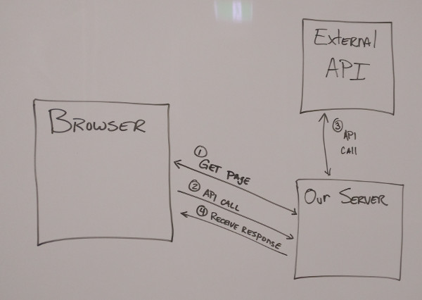

Cross-origin resource sharing (CORS) is a mechanism that allows restricted resources (e.g. fonts) on a web page to be requested from another origin outside the domain from which the first resource was served. For example, if our web app hosted at https://blog.foo.com and in our `index.html` page we have ``, that image (a resource) is considered be shared cross-origin. Some resources are not considered _restricted_. A web page may freely embed cross-origin images, stylesheets, scripts, iframes, and videos. Certain "cross-origin" requests, notably Ajax requests (web API calls), however are forbidden by default by the [same-origin security policy](https://en.wikipedia.org/wiki/Same-origin_policy). The same-origin security policy is a feature of web browsers that prevent a web page from one origin to run scripts from a different origin.

### What defines an origin?

The origin of a resource is defined by its URL. Specifically, the part of the URL before the first folder or file. Here are some examples of cross-origin and same-origin URLs:

* http://foo.com and https://foo.com: **cross-origin** because of different [URI schemes](https://en.wikipedia.org/wiki/Uniform_Resource_Identifier) (http/https)
* http://www.foo.com and http://blog.foo.com: **cross-origin** because of different [hostnames](https://en.wikipedia.org/wiki/Hostname) (www/blog)
* http://foo.com:3000 and http://foo.com:8080: **cross-origin** because of different [ports](https://en.wikipedia.org/wiki/Port_(computer_networking)) (3000/8080)
* http://foo.com and http://bar.com: **cross-origin** because of different domain names (foo/bar)
* http://foo.com/profile and http://foo.com/v1/users: **same-origin**

### Configuring CORS

CORS can only be configured on the server that provides the restricted resource. That means if we want to consume an API from the browser, and the URL of the API doesn't have the same origin as the page our script is running in, the server must be configured to allow requests from other origins. When a web API server has been configured to accept requests from other origins, it will include an `Access-Control-Allow-Origin` HTTP response header. As long as our client-side script came from a matching origin, we shouldn't be effected by the same-origin security policy.

But what if we can't change the configuration on the server? That just means we can't consume the API from a web browser. That doesn't mean we can't consume the API from our server. We can route requests from our client via our server (we won't need a CORS setup if our client and server have the same origin) and get our server to hit other servers. Note that our server doesn't have same-origin constraint, because the primary reason for a same-origin constraint is to avoid scripts running within a browser to read or interfere with the browser's DOM. This illustrates the relationship and calling pattern of the client getting results from the external API via our server.

